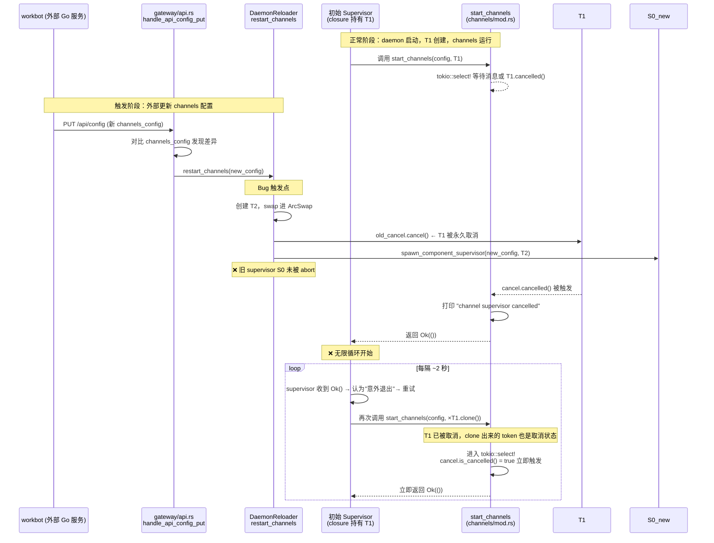
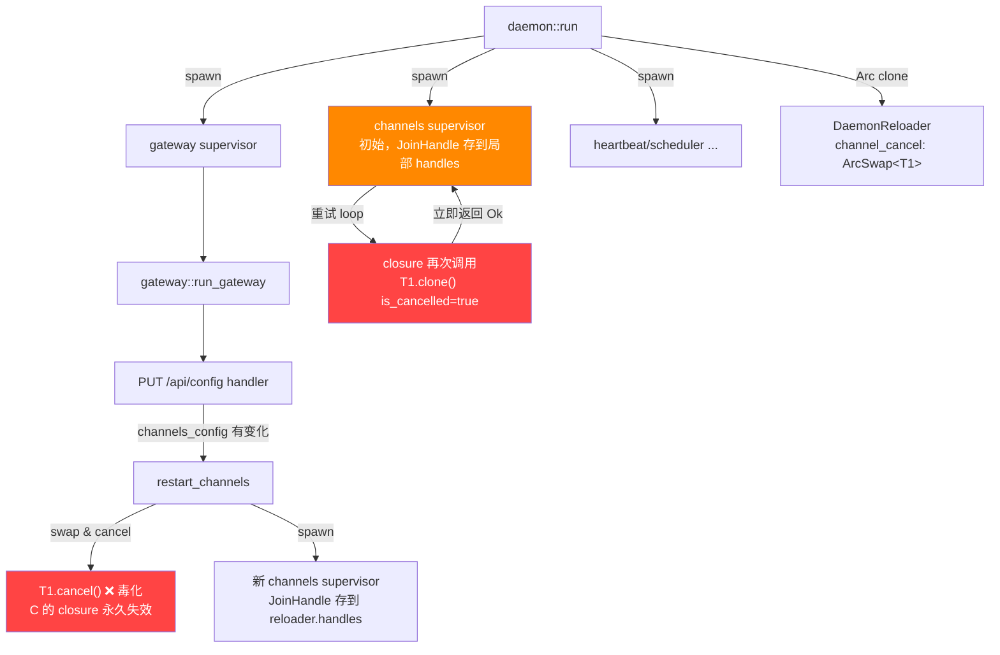
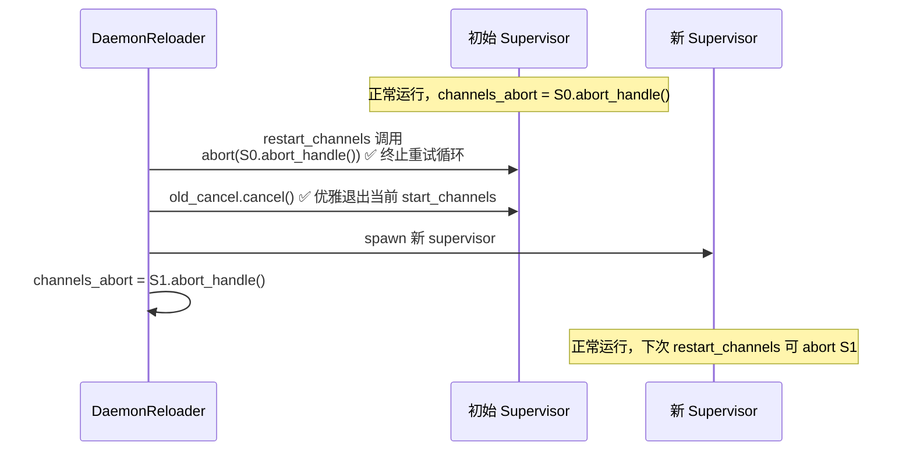

# Channels 无限重启 Bug 分析报告

**日期**: 2026-04-02
**分支**: feat/config-hot-reload
**涉及 commits**: `09164e40`, `7029b7a8`
**状态**: 已修复（待验证）

---

## 一、问题表现

zeroclaw daemon 启动后，`channels` 组件出现概率性无限重启，间隔约 2 秒（即 `channel_initial_backoff_secs` 默认值），日志持续滚动：

```
INFO  zeroclaw::daemon: [DIAG] channels closure invoked: token is_cancelled=true
INFO  zeroclaw::channels: [DIAG] entering tokio::select — cancel.is_cancelled=true
INFO  zeroclaw::channels: channel supervisor cancelled, shutting down channels
WARN  zeroclaw::daemon: Daemon component 'channels' exited unexpectedly
```

---

## 二、完整调用路径



---

## 三、根因定位

### 3.1 问题所在代码（修复前）

**`src/daemon/mod.rs` — 初始 supervisor 闭包（第 160–181 行）**

```rust
// ❌ 问题：cancel (Arc<CancellationToken>) 在 daemon 启动时一次性捕获
let cancel = reloader.channel_cancel.load().clone();  // 捕获的是 T1

handles.push(spawn_component_supervisor("channels", ..., move || {
    let c = (*cancel).clone();  // 每次重试都 clone T1，共享同一个取消状态
    async move { start_channels(cfg, c, s).await }
}));
// ❌ 问题：JoinHandle 只存到局部 handles，DaemonReloader 无法访问它
```

**`src/daemon/mod.rs` — `restart_channels`（第 74–104 行）**

```rust
fn restart_channels(&self, config: Config) {
    let new_cancel = Arc::new(CancellationToken::new());
    let old_cancel = self.channel_cancel.swap(new_cancel);
    old_cancel.cancel();  // T1 被取消

    // ❌ 问题：新的 supervisor 正确创建了
    let handle = spawn_component_supervisor("channels", ..., closure_with_T2);
    self.handles.lock().push(handle);

    // ❌ 问题：旧的初始 supervisor 完全不受影响
    //    它的 closure 持有的 T1 已经被毒化
    //    它的 JoinHandle 不在 self.handles 里（在 run() 的局部变量里）
    //    它会永远重试，每次用 T1.clone() 立即触发 cancelled()
}
```

### 3.2 Bug 在整体架构中的位置



---

## 四、证据链（来自诊断日志）

| 时间 | 日志 | 含义 |
|------|------|------|
| 09:43:34.793 | `[DIAG] restart_channels called — old_is_cancelled_before=false` | workbot 触发 PUT /api/config，T1 此时正常 |
| 09:43:34.793 | `channel supervisor cancelled` | T1 被取消，当前 start_channels 退出 ✓ |
| 09:43:34.794 | `config hot-reload applied actions=["channels-restarted"]` | 新 supervisor 启动 |
| 09:43:34.864 | `No channels configured` | 新 supervisor 用新 config 启动，无 feishu |
| 09:43:36.795 | `[DIAG] channels closure invoked: token is_cancelled=true` | ❌ 旧 supervisor 重试，T1 已死 |
| 09:43:36.879 | `[DIAG] entering tokio::select — cancel.is_cancelled=true` | ❌ 进 select 前就触发 |
| 09:43:36.879 | `Daemon component 'channels' exited unexpectedly` | ❌ 无限循环第 N 次 |

关键证据：**`restart_channels called` 只出现一次，但 `channels closure invoked: is_cancelled=true` 无限重复**，证明是旧 supervisor 的 closure 被毒化后永续循环，而非反复调用 `restart_channels`。

---

## 五、修复方案

### 核心思路

在 `DaemonReloader` 中用 `channels_abort: Mutex<Option<AbortHandle>>` 持有当前 channels supervisor 的中止句柄。`restart_channels` 调用时先 abort 旧 supervisor（终止其重试循环），再启动新的。

### 关键改动

**`src/daemon/mod.rs`**

```rust
pub(crate) struct DaemonReloader {
    // ... 原有字段 ...
    pub channels_abort: std::sync::Mutex<Option<tokio::task::AbortHandle>>,  // ← 新增
}

fn restart_channels(&self, config: Config) {
    // ✅ 先 abort 旧 supervisor，终止其重试循环
    if let Ok(mut h) = self.channels_abort.lock() {
        if let Some(abort) = h.take() {
            abort.abort();
        }
    }

    // 取消旧 token（让仍在运行的 start_channels 优雅退出）
    let new_cancel = Arc::new(CancellationToken::new());
    let old_cancel = self.channel_cancel.swap(new_cancel.clone());
    old_cancel.cancel();

    // 启动新 supervisor，持久化其 AbortHandle
    let handle = spawn_component_supervisor("channels", ..., new_closure_with_T2);
    if let Ok(mut h) = self.channels_abort.lock() {
        *h = Some(handle.abort_handle());  // ✅ 下次 restart_channels 可以 abort 它
    }
    // ...
}

// run() 中初始 supervisor 也要注册 AbortHandle
let ch_handle = spawn_component_supervisor("channels", ...);
if let Ok(mut h) = reloader.channels_abort.lock() {
    *h = Some(ch_handle.abort_handle());  // ✅ 初始 supervisor 也可被 abort
}
handles.push(ch_handle);
```

### 修复后的生命周期



---

## 六、验证方法

修复后，当 `PUT /api/config` 触发 `restart_channels` 时，应观察到：

**预期正常日志模式**：

```
[DIAG] restart_channels called — old_is_cancelled_before=false
channel supervisor cancelled, shutting down channels        ← 旧 supervisor 优雅退出
Daemon component 'channels' exited unexpectedly             ← 仅出现一次
[DIAG] channels closure invoked: token is_cancelled=false   ← 新 supervisor 启动，token 正常
[DIAG] entering tokio::select — cancel.is_cancelled=false   ← 正常进入等待
Listening for messages...                                   ← channels 恢复正常
```

**不应再出现**：
- `channels closure invoked: token is_cancelled=true` 持续滚动
- `Daemon component 'channels' exited unexpectedly` 持续滚动
